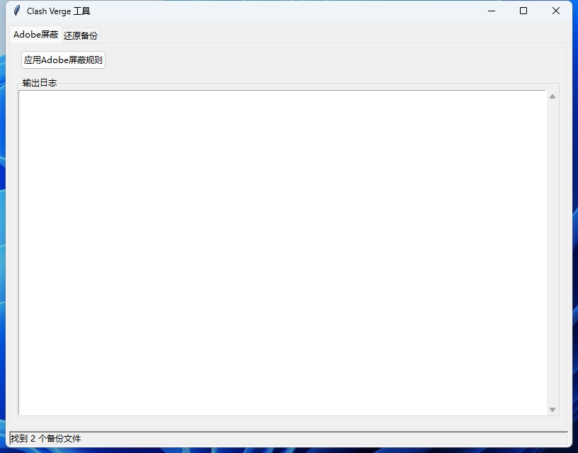

# Disadober

Disadober 是一个用于 Clash Verge 代理工具的管理工具，主要提供了 Adobe 域名屏蔽和配置备份还原功能。

## 开箱即用
下载Releases中的exe运行即可。

## 功能特性

- **Adobe 域名屏蔽**：自动下载和应用 Adobe 域名屏蔽规则，防止 Adobe 软件的联网验证
- **配置备份还原**：管理和恢复 Clash Verge 的配置文件备份
- **图形用户界面**：提供简单易用的图形界面，方便用户操作
- **多平台支持**：支持 Windows、macOS 和 Linux 操作系统

## 截图展示




## 安装

### 直接运行源码

1. 克隆此仓库：
   ```bash
   git clone https://github.com/yourusername/disadober.git
   ```

2. 进入项目目录：
   ```bash
   cd disadober
   ```

3. 运行主程序：
   ```bash
   python clash_verge_gui.py
   ```

## 使用说明

### 图形界面

运行 `clash_verge_gui.py` 启动图形界面，界面包含两个主要标签页：

#### Adobe 屏蔽标签页

- 点击"应用 Adobe 屏蔽规则"按钮来下载最新的 Adobe 域名列表并应用屏蔽规则
- 如果自动下载失败，提供了手动输入代理地址或直接输入域名的选项

#### 还原备份标签页

- 显示所有可用的配置文件备份
- 选择备份文件并点击"还原选中备份"按钮来恢复之前的配置

### 命令行工具

项目还提供了几个命令行工具：

- **clash_verge_adobe_block.py**：仅应用 Adobe 屏蔽规则
- **clash_verge_fix.py**：用于还原备份文件
  - 无参数：交互式选择备份
  - 参数为数字：按索引还原备份
  - 参数为文件名：按文件名还原备份

## 工作原理

1. **Adobe 屏蔽功能**：
   - 从网络下载 Adobe 域名列表或使用内置列表
   - 创建 JavaScript 脚本在 Clash Verge 中屏蔽这些域名
   - 备份原有配置并应用新配置

2. **备份还原功能**：
   - 自动备份修改前的配置文件
   - 提供界面浏览和还原之前的备份

## 系统要求

- Python 3.6 或更高版本
- Clash Verge 已安装并配置
- 网络连接（用于下载 Adobe 域名列表）

## 常见问题

1. **无法下载 Adobe 域名列表**
   - 程序会自动尝试多种代理方式
   - 如果全部失败，可以手动输入代理地址或直接输入域名列表

2. **应用规则后 Clash Verge 不生效**
   - 请确保在应用规则后重启 Clash Verge

3. **找不到备份文件**
   - 确认 Clash Verge 配置目录存在并且有读写权限

## 许可证

本项目基于 MIT 许可证发布。

## 贡献

欢迎通过 Issue 和 Pull Request 贡献代码和改进建议！